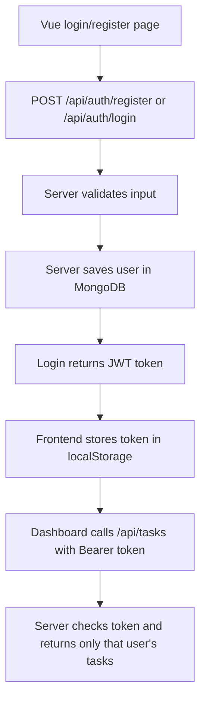

# StartupFlow Backend

This backend is intentionally small so it is easy to teach.

## What it does

- Registers users
- Logs users in and returns a JWT token
- Protects task routes with the token
- Stores data in MongoDB so the flow is easy to understand

## Folder structure

- `src/server.js` starts the app and checks MongoDB first
- `src/app.js` only sets up Express and mounts routes
- `src/routes/` maps URLs to controllers
- `src/controllers/` holds request logic
- `src/middleware/` protects task routes
- `src/models/` talks to MongoDB
- `src/config/mongo.js` opens the MongoDB connection

## Start the server

Use `src/server.js` to start the backend. That file imports `src/app.js`, connects to MongoDB first, and then listens on the port.

```bash
cd backend
npm install
set MONGODB_URI=mongodb://127.0.0.1:27017/startupflow
npm run dev
```

If you use PowerShell, set the environment variable like this:

```powershell
$env:MONGODB_URI = "mongodb://127.0.0.1:27017/startupflow"
npm run dev
```

You can also set `JWT_SECRET` the same way if you want a custom token secret.

## MongoDB setup

- Create a local MongoDB database named `startupflow` or change the URI to your own database name.
- The app uses the `users` collection for login and the `tasks` collection for task data.
- Email is treated as unique, so a second register with the same email is rejected.

## API flow

The API works in this order:

1. `GET /api/health` checks that the server is running.
2. `POST /api/auth/register` creates a user in MongoDB.
3. `POST /api/auth/login` checks the password and returns a JWT token.
4. `GET /api/tasks` returns only the logged-in user's tasks.
5. `POST /api/tasks` creates a new task.
6. `PUT /api/tasks/:id` updates one task.
7. `DELETE /api/tasks/:id` removes one task.

The task routes require this header after login:

`Authorization: Bearer YOUR_TOKEN_HERE`

## cURL examples

Register:

```bash
curl.exe -X POST http://localhost:5000/api/auth/register ^
  -H "Content-Type: application/json" ^
  -d "{\"name\":\"Amina\",\"email\":\"amina@example.com\",\"password\":\"123456\"}"
```

Login:

```bash
curl.exe -X POST http://localhost:5000/api/auth/login ^
  -H "Content-Type: application/json" ^
  -d "{\"email\":\"amina@example.com\",\"password\":\"123456\"}"
```

Get tasks:

```bash
curl.exe http://localhost:5000/api/tasks ^
  -H "Authorization: Bearer YOUR_TOKEN_HERE"
```

Create task:

```bash
curl.exe -X POST http://localhost:5000/api/tasks ^
  -H "Content-Type: application/json" ^
  -H "Authorization: Bearer YOUR_TOKEN_HERE" ^
  -d "{\"title\":\"Build landing page\"}"
```

Update task:

```bash
curl.exe -X PUT http://localhost:5000/api/tasks/TASK_ID ^
  -H "Content-Type: application/json" ^
  -H "Authorization: Bearer YOUR_TOKEN_HERE" ^
  -d "{\"title\":\"Update landing page\"}"
```

Delete task:

```bash
curl.exe -X DELETE http://localhost:5000/api/tasks/TASK_ID ^
  -H "Authorization: Bearer YOUR_TOKEN_HERE"
```

## Postman testing

Use the same requests above in Postman if you prefer a GUI.

For protected task requests, add this header after login:

`Authorization: Bearer YOUR_TOKEN_HERE`

Example Postman bodies:

```json
{
  "name": "Amina",
  "email": "amina@example.com",
  "password": "123456"
}
```

```json
{
  "email": "amina@example.com",
  "password": "123456"
}
```

```json
{
  "title": "Build landing page"
}
```

## Flow



## API summary

- `POST /api/auth/register` creates a new user
- `POST /api/auth/login` returns a token and safe user profile
- `GET /api/tasks` returns tasks for the logged-in user
- `POST /api/tasks` creates a task
- `PUT /api/tasks/:id` updates a task
- `DELETE /api/tasks/:id` deletes a task

## Tested locally

The backend was verified with real requests against these endpoints:

- `GET /api/health`
- `POST /api/auth/register`
- `POST /api/auth/login`
- `POST /api/tasks`
- `GET /api/tasks`

The tested flow was: register a user, log in, create a task, and list tasks with the Bearer token.

## Teaching notes

- Keep the request flow simple: form -> API call -> validation -> save -> response.
- Keep token handling visible: login returns token, frontend stores token, task routes read token.
- Start from `src/server.js`, then read `src/app.js`, then move into routes, controllers, middleware, and models.
